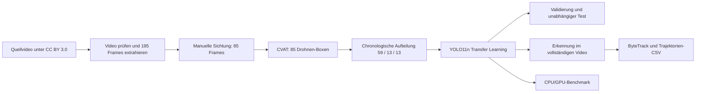

# Demo zur UAV-Erkennung und -Verfolgung

[EN](README.md) | [CN](README.zh-CN.md) | [GitHub-Veröffentlichungsanleitung](GITHUB_PUBLISHING.md)

## Demo-Videos

- [Vollständiges Erkennungsvideo herunterladen](https://github.com/MingchuanLuo/uav_detection_tracking_demo/releases/latest/download/Quadcopter_detection.mp4)
- [Vollständiges ByteTrack-Video herunterladen](https://github.com/MingchuanLuo/uav_detection_tracking_demo/releases/latest/download/Quadcopter_tracking.mp4)
- [Alle Release-Dateien anzeigen](https://github.com/MingchuanLuo/uav_detection_tracking_demo/releases/latest)

Da dieses Repository privat ist, funktionieren die Release-Links nur für
angemeldete GitHub-Nutzer, denen Zugriff auf das Repository gewährt wurde.

Dieses Repository zeigt eine kleine, aber vollständige Computer-Vision-Pipeline
zur Erkennung und Verfolgung einer Drohne. Ausgehend von einem lizenzierten
Video umfasst das Projekt die Bildauswahl, manuelle Annotation, eine zeitlich
chronologische Datensatzaufteilung, Transfer Learning mit YOLO11n, getrennte
Validierung und Tests, die Erkennung im vollständigen Video, ByteTrack-Tracking,
den Export von Trajektorien sowie einen synchronisierten CPU/GPU-Benchmark.

Das Projekt demonstriert einen nachvollziehbaren End-to-End-Workflow und ist
nicht als produktionsreifer UAV-Detektor zu verstehen. Insbesondere zeigt der
zeitlich spätere Testsatz deutlich, dass sehr kleine Objekte nicht zuverlässig
erkannt werden. Eine zufällige Aufteilung benachbarter Videoframes hätte dieses
Problem leicht verdeckt.


## Ergebnisse im Überblick

| Punkt | Ergebnis |
| --- | --- |
| Quelle | Ein UAV-Video, 1920 x 1080, 25 FPS, 64,88 s |
| Frame-Auswahl | 195 Kandidaten mit ungefähr 3 FPS |
| Manuelle Sichtung | 85 ausgewählt, 110 verworfen |
| Annotation | 85 YOLO-Boxen, eine Klasse: `drone` |
| Aufteilung | 59 Training / 13 Validierung / 13 Test, chronologisch |
| Modell | Vortrainiertes YOLO11n, 50 Epochen, `imgsz=960` |
| Bester Checkpoint | Epoche 33, Validierungs-mAP@0.5:0.95 = 0,6602 |
| Testergebnis | Precision 0,9838, Recall 0,3077, mAP@0.5:0.95 = 0,1525 |
| Gesamtes Erkennungsvideo | 707 Frames mit Erkennung bei 1.619 dekodierten Frames, 45,2 FPS |
| Tracking | 679 Frames mit Track; 21 Track-Fragmente für ein reales UAV |
| Benchmark | CPU 27,73 FPS; NVIDIA RTX 4060 123,58 FPS |

## Pipeline



Die Skripte behandeln das unveränderte Quellvideo, manuelle Annotationen und
generierte Ergebnisse getrennt. Die Bounding Boxes wurden von Hand erstellt;
der Trainingscode erzeugt keine künstlichen Ground-Truth-Labels.

## Daten und zeitliche Aufteilung

### Quellvideo

Als Eingabe dient
[„Quadcopter (drone)“](https://commons.wikimedia.org/wiki/File%3AQuadcopter_%28drone%29.webm).
Das Video wurde am 29. Mai 2018 aufgenommen und auf Wikimedia Commons unter
CC BY 3.0 veröffentlicht. Die unveränderte lokale Datei liegt unter:

```text
video/Quadcopter_(drone).webm
```

| Eigenschaft | Wert |
| --- | ---: |
| Auflösung | 1920 x 1080 |
| Bildrate | 25 FPS |
| Frame-Anzahl laut Container | 1.622 |
| Erfolgreich mit OpenCV dekodiert | 1.619 Frames |
| Container-Dauer | 64,88 s |
| Letzter dekodierter Zeitstempel | 64,72 s |
| Codec | VP9 (`VP90`) |
| SHA-1 | `AB8E308532ED3483AB8D120AE23282EE5715E9EC` |

Der WebM-Index meldet drei Frames mehr, als OpenCV tatsächlich dekodieren kann.
Beide Werte werden dokumentiert. Download und Prüfsumme sind in
[video/README.md](video/README.md) beschrieben.

### Frame-Auswahl und Annotation

Mit ungefähr 3 FPS wurden 195 Kandidaten zwischen 0,00 und 64,68 Sekunden
extrahiert. Bei der manuellen Sichtung blieben 85 nützliche Bilder übrig;
110 leere, unbrauchbare oder stark redundante Bilder wurden verworfen.

Alle ausgewählten Bilder wurden in CVAT manuell mit genau einer rechteckigen
Bounding Box und einer Klasse annotiert:

```text
0 = drone
```

Eine YOLO-Annotationszeile enthält normalisierte Koordinaten:

```text
class_id x_center y_center width height
0 0.521 0.423 0.062 0.037
```

Alle 85 Bild-/Label-Paare wurden auf passende Dateinamen, korrekte Klassen-ID,
gültige Zahlen, Wertebereiche, Bildgrenzen und genau eine Box pro Bild geprüft.

### Training, Validierung und Test in Sekunden

Die ausgewählten Bilder wurden nach ihrem Zeitstempel sortiert und in
zusammenhängende Zeitblöcke geteilt. „Training bis ungefähr Sekunde 40“ bedeutet,
dass die ausgewählten Trainingsbilder von 0,68 bis 39,36 Sekunden reichen. Es
bedeutet nicht, dass jedes einzelne Videoframe in diesem Zeitraum trainiert wurde.

| Split | Bilder | Zeitbereich im Video | Median der Box bei 1920 x 1080 | Größenbereich |
| --- | ---: | ---: | ---: | ---: |
| Training | 59 | 0,68-39,36 s | 222 x 85 px | Breite 115,1-1.262,7; Höhe 45,7-298,8 px |
| Validierung | 13 | 39,68-44,36 s | 328 x 124,3 px | Breite 111,5-813,2; Höhe 55,7-335,3 px |
| Test | 13 | 44,68-54,68 s | 28 x 13,9 px | Breite 19,4-91,4; Höhe 9,5-43,0 px |

Der Abschnitt von 54,68 Sekunden bis zum Ende des dekodierten Videos wurde nur
für die visuelle Gesamtvideo-Auswertung verwendet und enthält in diesem kleinen
Datensatz keine annotierten Testbilder.

Eine zufällige Aufteilung würde nahezu identische Nachbarframes gleichzeitig in
Training und Test platzieren. Das könnte die gemessene Genauigkeit künstlich
erhöhen. Die chronologische Aufteilung ist schwieriger, bewertet aber sinnvoller,
ob das Modell auf zeitlich spätere Bilder generalisiert.

## Training

Das Training startet mit den offiziellen vortrainierten Gewichten
`yolo11n.pt`. Beim Transfer Learning werden bereits gelernte allgemeine visuelle
Merkmale weiterverwendet und für die einzige Klasse `drone` angepasst. Bei nur
59 Trainingsbildern wäre ein Training von zufälligen Startgewichten ungeeignet.

### Aufgezeichnete Konfiguration

| Parameter | Wert |
| --- | --- |
| Modell | YOLO11n Detection, vortrainiert |
| Epochen | 50 |
| Eingabegröße | 960 |
| Batch-Größe | 8 |
| Optimierer | automatische Auswahl durch Ultralytics |
| Gerät | NVIDIA GeForce RTX 4060, CUDA-Gerät `0` |
| Worker | 4 |
| Early-Stopping-Patience | 20 |
| Seed | 42 |
| Cache | aktiviert |
| Mixed Precision | durch Ultralytics aktiviert |

Aufgezeichnete Softwareumgebung:

| Komponente | Version |
| --- | --- |
| Python | 3.12.13 |
| PyTorch | 2.11.0+cu128 |
| Ultralytics | 8.4.153 |
| PyTorch-CUDA-Runtime | 12.8 |

Trainingsbefehl:

```powershell
.venv\Scripts\python.exe src\train_yolo.py `
  --model yolo11n.pt `
  --epochs 50 `
  --imgsz 960 `
  --batch 8 `
  --device 0 `
  --workers 4 `
  --patience 20 `
  --seed 42 `
  --cache
```

Der Validierungssatz überwacht während des Trainings die Generalisierung und
dient zur Auswahl des besten Checkpoints. Der beste Validierungswert wurde in
Epoche 33 erreicht. Der Testsatz wurde nicht zur Modellauswahl verwendet und
erst anschließend ausgewertet.

```text
outputs/models/uav_detector_best.pt   bester Validierungs-Checkpoint
outputs/models/uav_detector_last.pt   Gewichte nach der letzten Epoche
```

## Validierungs- und Testergebnisse

```powershell
.venv\Scripts\python.exe src\evaluate_model.py `
  --model outputs\models\uav_detector_best.pt `
  --split both `
  --imgsz 960 `
  --batch 8 `
  --device 0 `
  --workers 4
```

| Split | Bilder | Precision | Recall | F1 | mAP@0.5 | mAP@0.5:0.95 |
| --- | ---: | ---: | ---: | ---: | ---: | ---: |
| Validierung | 13 | 0,9869 | 1,0000 | 0,9934 | 0,9950 | 0,6602 |
| Test | 13 | 0,9838 | 0,3077 | 0,4688 | 0,3050 | 0,1525 |

Bedeutung der Kennzahlen:

- **Precision**: Anteil der ausgegebenen UAV-Boxen, die mit Ground Truth
  übereinstimmen. Die hohe Test-Precision bedeutet, dass die wenigen
  ausgegebenen Boxen meistens korrekt waren.
- **Recall**: Anteil der annotierten UAVs, die erkannt wurden. Ein Test-Recall
  von 0,3077 entspricht ungefähr 4 erkannten von 13 annotierten Instanzen.
- **F1**: harmonisches Mittel aus Precision und Recall.
- **mAP@0.5**: Average Precision mit einer IoU-Zuordnungsschwelle von 0,5.
- **mAP@0.5:0.95**: Mittelwert über strengere IoU-Schwellen von 0,50 bis 0,95
  und damit empfindlicher gegenüber ungenauer Lokalisierung.
- **IoU**: Überlappung zwischen Vorhersage und Ground-Truth-Box. IoU ist nicht
  die Zahl, die im Demo-Video neben der Box steht.

### Warum wird die sehr kleine Drohne am Ende nicht erkannt?

Die Hauptursache ist eine Verschiebung der Objektgrößen zwischen Training und
Test:

1. Die mediane Trainingsbox ist im Originalbild 222 x 85 Pixel groß. Selbst die
   kleinste Trainingsbox misst ungefähr 115 x 46 Pixel.
2. Die mediane Testbox misst nur 28 x 14 Pixel. Bei `imgsz=960` wird das
   1920 Pixel breite Bild ungefähr halbiert; übrig bleiben etwa 14 x 7 Pixel im
   Modelleingang.
3. Der Detektor reduziert die räumliche Auflösung weiter, um Feature Maps zu
   bilden. Bei einem nur wenige Pixel hohen Objekt bleiben nach Skalierung und
   Downsampling kaum stabile Form- oder Texturmerkmale erhalten.
4. Videokompression, Bewegungsunschärfe, Kamerabewegung und ein ähnlicher
   Hintergrund erschweren die Aufgabe zusätzlich.
5. Der UAV-spezifische Fine-Tuning-Datensatz enthält keine vergleichbar kleinen
   Drohnen. Das Modell hat für diese Skala daher keine robuste Entscheidung
   gelernt.
6. Fällt die Konfidenz unter den Inferenz-Schwellwert, wird keine Box ausgegeben.
   Ohne Erkennungen kann ByteTrack eine Trajektorie nicht dauerhaft fortsetzen.

Das erklärt die Kombination aus hoher Precision und niedrigem Recall: Wenn das
Modell eine Box ausgibt, ist sie meistens korrekt, aber viele sehr kleine Ziele
werden übersehen. Mehr kleine und weit entfernte UAV-Beispiele sind die
wichtigste Verbesserung. Zusätzliche Epochen allein ersetzen die fehlende
Skalenabdeckung nicht.

## Erkennung im vollständigen Video

```powershell
.venv\Scripts\python.exe src\detect_video.py --device 0
```

| Einstellung oder Ergebnis | Wert |
| --- | ---: |
| Eingabegröße | 960 |
| Konfidenzschwelle | 0,30 |
| NMS-IoU-Schwelle | 0,50 |
| Maximale Erkennungen pro Frame | 1 |
| Verarbeitete Frames | 1.619 |
| Frames mit Erkennung | 707 |
| Mittlere Konfidenz ausgegebener Boxen | 0,8139 |
| End-to-End-Verarbeitungsrate | 45,2 FPS |

`max_det=1` ist hier beabsichtigt, weil das Quellvideo genau ein physisches UAV
enthält. Für Videos mit mehreren UAVs muss dieser Wert erhöht werden.

### Was bedeutet die Zahl `0.9...` an der Box?

Eine Beschriftung wie `drone 0.94` enthält die vorhergesagte Klasse und den
Konfidenzwert des Detektors. Ein höherer Wert bedeutet, dass dieses Modell für
diese Box stärkere Hinweise auf die Klasse `drone` sieht.

Der Wert ist keine Garantie, keine streng kalibrierte reale Wahrscheinlichkeit,
nicht die IoU mit Ground Truth und auch keine Tracking-ID. Das Erkennungsvideo
zeigt nur Boxen ab 0,30. Für das Tracking wird die niedrigere Schwelle 0,10
verwendet, damit ByteTrack auch schwächere Beobachtungen verbinden kann. Eine
niedrigere Schwelle kann kleine Ziele zurückbringen, erzeugt aber mehr
Fehlalarme.

`detections.csv` enthält pro ausgegebener Box:

```text
frame_number, timestamp_seconds, class_id, class_name, confidence,
x1, y1, x2, y2, center_x, center_y
```

Die 707 Frames mit Erkennung sind keine Genauigkeitsmetrik, da nicht jedes Frame
des vollständigen Videos manuell annotiert wurde.

## ByteTrack und Trajektorie

```powershell
.venv\Scripts\python.exe src\track_video.py --device 0
```

Verwendet werden ByteTrack mit persistentem Zustand, `imgsz=960`, `conf=0.10`,
`iou=0.50`, `max_det=1` und eine Trajektorie aus den letzten 30 Mittelpunkten.

Die Einblendungen bedeuten:

- `Drone #ID`: temporäre Tracker-ID, nicht die Anzahl physischer Drohnen;
- Konfidenz: Detektorwert der aktuellen Beobachtung;
- Box und Mittelpunkt: aktuelle Position in Bildkoordinaten;
- farbige Linie: Verlauf der letzten Box-Mittelpunkte;
- Richtung und `px/s`: scheinbare Bewegung in Bildpixeln pro Sekunde;
- HUD-Zähler: aktuell aktive Tracks und bisher beobachtete IDs.

Die x-Koordinate wächst nach rechts, die y-Koordinate nach unten. Die angezeigte
Pixelgeschwindigkeit ist keine physische UAV-Geschwindigkeit. Sie enthält auch
Kamerabewegung, Perspektive, Box-Jitter und Größenänderungen. Für Meter pro
Sekunde wären Kamerakalibrierung und zuverlässige Entfernungsinformationen nötig.

Obwohl das Video nur ein UAV enthält, entstanden 21 Tracker-IDs. Das sind 21
Track-Fragmente nach Erkennungslücken und fehlgeschlagener Wiederzuordnung, nicht
21 verschiedene Drohnen.

## Ergebnisse anzeigen

Unter Windows können Videos und Diagramme direkt aus PowerShell geöffnet werden:

```powershell
Start-Process "outputs\detections\Quadcopter_detection.mp4"
Start-Process "outputs\tracking\Quadcopter_tracking.mp4"
Start-Process "outputs\plots\training\results.png"
Start-Process "outputs\plots\evaluation_test\val_batch0_pred.jpg"
```

CSV-Dateien lassen sich interaktiv anzeigen:

```powershell
Import-Csv "outputs\detections\detections.csv" | Out-GridView
Import-Csv "outputs\tracking\trajectory.csv" | Out-GridView
Import-Csv "outputs\metrics\evaluation_metrics.csv" | Format-Table
Import-Csv "outputs\metrics\benchmark.csv" | Format-Table
```

| Datei | Bedeutung |
| --- | --- |
| `outputs/models/uav_detector_best.pt` | anhand der Validierung ausgewählter Checkpoint |
| `outputs/plots/training/results.png` | Trainingsverluste und Metriken je Epoche |
| `outputs/plots/evaluation_test/` | Testvorhersagen, Kurven und Konfusionsmatrix |
| `outputs/detections/Quadcopter_detection.mp4` | Boxen und Konfidenzen im Gesamtvideo |
| `outputs/detections/detections.csv` | Koordinaten und Konfidenz jeder Erkennung |
| `outputs/tracking/Quadcopter_tracking.mp4` | IDs, Verlauf, Richtung und Pixelgeschwindigkeit |
| `outputs/tracking/trajectory.csv` | Track- und Bewegungsdaten je Beobachtung |
| `outputs/metrics/benchmark.csv` | Zusammenfassung des CPU/GPU-Benchmarks |

Die mit OpenCV erzeugten MP4-Dateien enthalten nur Video; die Audiospur des
Quellvideos wird nicht übernommen.

## CPU/GPU-Benchmark

```powershell
.venv\Scripts\python.exe src\benchmark.py --devices both
```

Der Benchmark verteilt 24 Stichproben gleichmäßig über die 1.619 dekodierbaren
Frames. Pro Gerät werden fünf ungemessene Warm-ups und anschließend drei
Durchläufe ausgeführt, insgesamt also 72 Messungen mit Batch-Größe 1. CUDA wird
vor und nach jeder GPU-Messung explizit synchronisiert.

Gemessen werden Ultralytics-Preprocessing, Host-/Device-Transfer, Inferenz, NMS
und die Übertragung der finalen Boxen in den CPU-Speicher. Nicht enthalten sind
Videodekodierung, Zeichnen, Kodierung, Laden des Modells und Warm-up.

| Gerät | Mittlere Latenz | Median | P95 | Durchsatz |
| --- | ---: | ---: | ---: | ---: |
| Intel Core i7-14700K, 8 PyTorch-Threads | 36,06 ms | 35,63 ms | 40,18 ms | 27,73 FPS |
| NVIDIA GeForce RTX 4060 | 8,09 ms | 7,23 ms | 11,50 ms | 123,58 FPS |

Gemessen an der mittleren Latenz ist die GPU ungefähr 4,46-mal schneller. Diese
Werte gelten für den aufgezeichneten Rechner und diese Konfiguration; sie sind
keine allgemeine YOLO11n-Leistungsangabe.

## Installation und Schnellstart

Python 3.12 wird empfohlen. Die Beispiele verwenden Windows PowerShell.

```powershell
python -m venv .venv
.venv\Scripts\python.exe -m pip install --upgrade pip
.venv\Scripts\python.exe -m pip install torch torchvision --index-url https://download.pytorch.org/whl/cu128
.venv\Scripts\python.exe -m pip install -r requirements.txt
```

Die PyTorch-Variante muss zum Betriebssystem, zur GPU und zum Treiber passen.
Für reine CPU-Inferenz ist kein CUDA-Build erforderlich.

Für die Inferenz werden diese Dateien erwartet:

```text
video/Quadcopter_(drone).webm
outputs/models/uav_detector_best.pt
```

Danach können Erkennung oder Tracking gestartet werden:

```powershell
.venv\Scripts\python.exe src\detect_video.py --device auto
.venv\Scripts\python.exe src\track_video.py --device auto
```

Das Quellvideo kann von Wikimedia Commons heruntergeladen werden. Checkpoint
und Ergebnisvideos werden als GitHub-Release-Dateien bereitgestellt und nicht
als normale Git-Blobs versioniert.

## Vollständiges Experiment reproduzieren

```powershell
# 1. Video prüfen und Vorschaubilder erzeugen.
.venv\Scripts\python.exe src\inspect_video.py --preview-count 8

# 2. Kandidaten extrahieren.
.venv\Scripts\python.exe src\extract_frames.py --target-fps 3

# 3. Alle Kandidaten manuell in selected_frames oder rejected_frames verschieben.
.venv\Scripts\python.exe src\reconcile_screening.py --require-complete

# 4. In CVAT annotieren und YOLO-Labels nach data/labels exportieren.
.venv\Scripts\python.exe src\validate_labels.py --preview-count 12 --seed 42

# 5. Chronologischen Datensatz erzeugen.
.venv\Scripts\python.exe src\prepare_dataset.py --train-ratio 0.70 --val-ratio 0.15

# 6. Modell trainieren und auswerten.
.venv\Scripts\python.exe src\train_yolo.py --model yolo11n.pt --epochs 50 --imgsz 960 --batch 8 --device auto --workers 4 --patience 20 --seed 42 --cache
.venv\Scripts\python.exe src\evaluate_model.py --split both --imgsz 960 --batch 8 --device auto --workers 4

# 7. Videos und Benchmark erzeugen.
.venv\Scripts\python.exe src\detect_video.py --device auto
.venv\Scripts\python.exe src\track_video.py --device auto
.venv\Scripts\python.exe src\benchmark.py --devices both
```

Sichtung und Annotation bleiben absichtlich manuell. Ein frischer Clone enthält
weder die generierten Bildordner noch den erzeugten YOLO-Datensatz. Diese Daten
müssen nach dem beschriebenen Ablauf neu erzeugt oder separat bereitgestellt
werden.

## Einschränkungen und nächste Schritte

- nur ein Video, eine Szene, eine Kamera und ein physisches UAV;
- lediglich 59 Trainings- und 13 Validierungsbilder;
- alle annotierten Bilder enthalten ein UAV, daher keine systematische Bewertung
  von Fehlalarmen auf reinen Hintergrundbildern;
- keine vergleichbar kleinen UAVs im Fine-Tuning-Trainingssatz;
- `max_det=1`, daher nicht für mehrere UAVs oder Schwärme geeignet;
- fragmentierte Tracking-IDs nach Erkennungslücken; und
- nur Bildbewegung, keine metrische Entfernung oder Geschwindigkeit.

Die wichtigste Verbesserung ist ein größerer, vielfältiger Datensatz mit
kleinen und weit entfernten UAVs, leeren Frames sowie Vögeln und Flugzeugen als
schwierigen Negativbeispielen. Danach sind eine höhere Eingabeauflösung,
gekachelte Inferenz, Small-Object-Augmentation, größere Modelle,
Re-Identifikation, Kamerabewegungskompensation und TensorRT/Jetson-Deployment
sinnvolle Experimente.

## Urheberrecht, Lizenzen und Quellenangabe

Das Quellvideo gehört nicht zu diesem Projekt:

> „Quadcopter (drone)“ von Sounds of Changes / Työväenmuseo Werstas;
> Ton-/Videoaufnahme und Fotografie: Mikael Maffei. Aufgenommen am 29. Mai 2018.
> Über Wikimedia Commons unter Creative Commons Attribution 3.0 Unported
> veröffentlicht.

- Quelle: [Wikimedia-Commons-Dateiseite](https://commons.wikimedia.org/wiki/File%3AQuadcopter_%28drone%29.webm)
- Lizenz: [CC BY 3.0](https://creativecommons.org/licenses/by/3.0/)
- Änderungen: Frames wurden extrahiert, Modelleingaben skaliert und Bounding
  Boxes, Konfidenzwerte, Tracker-IDs, Trajektorien sowie HUD-Text eingeblendet.
  Die erzeugten MP4-Dateien enthalten nicht die ursprüngliche Audiospur.

CC BY 3.0 erlaubt Weitergabe und Bearbeitung unter der Bedingung, dass eine
angemessene Namensnennung, ein Lizenzlink und ein Hinweis auf Änderungen
enthalten sind. Die Quellenangabe bedeutet keine Unterstützung des Projekts
durch die ursprünglichen Urheber.

Ultralytics stellt Framework und Modelle im Open-Source-Modell unter AGPL-3.0
bereit und bietet alternativ eine Enterprise-Lizenz an. Die Medienlizenz
CC BY 3.0, die Lizenz des Projektcodes und die Lizenzen der Drittanbieter-
Software bleiben voneinander getrennt.
