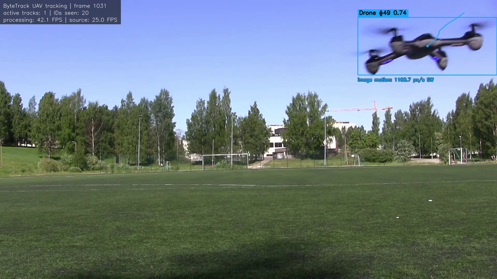
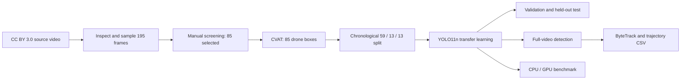

# UAV Detection and Tracking Demo

[中文说明](README.zh-CN.md) | [GitHub publishing guide](GITHUB_PUBLISHING.md)

This repository is a compact but complete computer-vision demo that takes one
licensed UAV video through data selection, manual annotation, chronological
dataset splitting, YOLO11n transfer learning, held-out evaluation, full-video
detection, ByteTrack tracking, trajectory export, and a synchronized CPU/GPU
benchmark.

The project is intentionally small and honest about its limits. It demonstrates
an end-to-end workflow; it is not presented as a production-ready UAV detector.
In particular, the held-out test block exposes a clear small-object failure that
would be easy to hide with a random frame split.



## Highlights

| Item | Result |
| --- | --- |
| Source | One 1920 x 1080, 25 FPS, 64.88 s UAV video |
| Candidate sampling | 195 frames at approximately 3 FPS |
| Manual screening | 85 selected, 110 rejected |
| Annotation | 85 YOLO boxes, one class: `drone` |
| Split | 59 train / 13 validation / 13 test, chronological |
| Model | Pretrained YOLO11n fine-tuned for 50 epochs at `imgsz=960` |
| Best checkpoint | Epoch 33, validation mAP@0.5:0.95 = 0.6602 |
| Test result | Precision 0.9838, recall 0.3077, mAP@0.5:0.95 = 0.1525 |
| Full-video detection | 707 detections across 1,619 decoded frames, 45.2 FPS end to end |
| Tracking | 679 tracked frames; 21 fragmented tracker IDs for one physical UAV |
| Controlled benchmark | CPU 27.73 FPS; RTX 4060 GPU 123.58 FPS |

## Pipeline



The scripts preserve the source video and generated artifacts separately. Human
screening and boxes are treated as ground truth; labels are never fabricated by
the training code.

## Data and timeline

### Source video

The input is
[“Quadcopter (drone)”](https://commons.wikimedia.org/wiki/File%3AQuadcopter_%28drone%29.webm),
recorded on 29 May 2018 and published on Wikimedia Commons under CC BY 3.0.
The local file is kept unchanged at:

```text
video/Quadcopter_(drone).webm
```

| Property | Value |
| --- | ---: |
| Resolution | 1920 x 1080 |
| Frame rate | 25 FPS |
| Container frame count | 1,622 |
| Successfully decoded frames | 1,619 |
| Container duration | 64.88 s |
| Last decoded timestamp | 64.72 s |
| Codec | VP9 (`VP90`) |
| SHA-1 | `AB8E308532ED3483AB8D120AE23282EE5715E9EC` |

The WebM index advertises three more tail frames than OpenCV can decode. The
project records both values instead of silently hiding this discrepancy.
Download and verification instructions are in [video/README.md](video/README.md).

### Screening and annotation

Frames were sampled at approximately 3 FPS, producing 195 candidates from
0.00 s to 64.68 s. Manual screening retained 85 useful frames and rejected 110
frames that were empty, unusable, excessively repetitive, or not reliably
annotatable. Each retained frame was annotated manually in CVAT with one tight
rectangle and one class:

```text
0 = drone
```

YOLO labels use normalized coordinates:

```text
class_id x_center y_center width height
0 0.521 0.423 0.062 0.037
```

All 85 image/label pairs passed checks for matching filenames, class ID, numeric
syntax, normalized ranges, image boundaries, and the expected one-box rule.

### Chronological split and exact time ranges

The selected images were sorted by original video time and divided into
contiguous blocks. “Training until about 40 seconds” means that selected
training examples range from 0.68 s through 39.36 s; it does not mean that every
frame in that interval is part of the dataset.

| Split | Images | Source timestamps | Median box at 1920 x 1080 | Box range |
| --- | ---: | ---: | ---: | ---: |
| Train | 59 | 0.68-39.36 s | 222 x 85 px | 115.1-1,262.7 px wide; 45.7-298.8 px high |
| Validation | 13 | 39.68-44.36 s | 328 x 124.3 px | 111.5-813.2 px wide; 55.7-335.3 px high |
| Test | 13 | 44.68-54.68 s | 28 x 13.9 px | 19.4-91.4 px wide; 9.5-43.0 px high |

The final 54.68-64.76 s of decoded video is used for full-video visual
inspection but contains no labelled evaluation samples in this small dataset.

A random split of neighboring video frames would place almost identical images
in training and evaluation and inflate the apparent score. The chronological
split is harder, but it gives a more meaningful demonstration of temporal
generalization.

## Training

The model starts from official pretrained `yolo11n.pt` weights. Transfer
learning reuses general visual features learned previously, then fine-tunes them
for the single `drone` class. Training from pretrained weights is especially
important here because 59 training images are far too few for learning a useful
detector from random initialization.

### Recorded configuration

| Parameter | Value |
| --- | --- |
| Model | YOLO11n detection, pretrained weights |
| Epochs | 50 |
| Image size | 960 |
| Batch size | 8 |
| Optimizer | Ultralytics automatic selection |
| Device | NVIDIA GeForce RTX 4060, CUDA device `0` |
| Workers | 4 |
| Early-stopping patience | 20 |
| Seed | 42 |
| Cache | Enabled |
| Mixed precision | Enabled by Ultralytics |

Recorded software environment:

| Component | Version |
| --- | --- |
| Python | 3.12.13 |
| PyTorch | 2.11.0+cu128 |
| Ultralytics | 8.4.153 |
| PyTorch CUDA runtime | 12.8 |

Recorded command:

```powershell
.venv\Scripts\python.exe src\train_yolo.py `
  --model yolo11n.pt `
  --epochs 50 `
  --imgsz 960 `
  --batch 8 `
  --device 0 `
  --workers 4 `
  --patience 20 `
  --seed 42 `
  --cache
```

The validation set is used during training to monitor generalization and select
the checkpoint. The best validation checkpoint occurred at epoch 33. The test
set was kept out of model selection and evaluated afterwards.

Stable checkpoint paths:

```text
outputs/models/uav_detector_best.pt
outputs/models/uav_detector_last.pt
```

## Validation and test results

```powershell
.venv\Scripts\python.exe src\evaluate_model.py `
  --model outputs\models\uav_detector_best.pt `
  --split both `
  --imgsz 960 `
  --batch 8 `
  --device 0 `
  --workers 4
```

| Split | Images | Precision | Recall | F1 | mAP@0.5 | mAP@0.5:0.95 |
| --- | ---: | ---: | ---: | ---: | ---: | ---: |
| Validation | 13 | 0.9869 | 1.0000 | 0.9934 | 0.9950 | 0.6602 |
| Test | 13 | 0.9838 | 0.3077 | 0.4688 | 0.3050 | 0.1525 |

Metric meanings:

- **Precision**: among predicted UAV boxes, the fraction that match ground
  truth. High test precision means the few boxes reported were usually correct.
- **Recall**: among labelled UAVs, the fraction detected. Test recall 0.3077 is
  approximately 4 detections out of 13 labelled test instances.
- **F1**: harmonic mean of precision and recall. It falls when either is poor.
- **mAP@0.5**: average precision using an IoU match threshold of 0.5.
- **mAP@0.5:0.95**: average over IoU thresholds 0.50 through 0.95; it is stricter
  and more sensitive to box localization quality.
- **IoU**: intersection over union between predicted and ground-truth boxes.
  IoU is not the number displayed next to a box in the demo video.

### Why the small UAV disappears near the end

This is a dataset-distribution problem, not a video-player problem:

1. The median training UAV is 222 x 85 pixels in the original frame, and even
   the smallest training box is approximately 115 x 46 pixels.
2. The median held-out test UAV is only 28 x 14 pixels. At `imgsz=960`, the
   1920-pixel-wide frame is reduced by roughly half, leaving a median target of
   only about 14 x 7 model-input pixels.
3. A detector downsamples the image into feature maps. A target only a few
   pixels high has little distinctive structure left after resizing and
   downsampling. Compression, motion blur, camera movement, and background
   similarity make this harder still.
4. The UAV-specific fine-tuning set contains no comparably tiny examples, so
   the model has not learned a reliable decision boundary for this scale.
5. When the confidence drops below the inference threshold, no detection is
   emitted. ByteTrack cannot maintain a track when detections disappear for too
   long, so the identity is also fragmented.

This explains the combination of high test precision and low recall: the model
is conservative and usually correct when it fires, but misses most very small
targets. More small/distant UAV examples are the first improvement to make;
simply increasing the number of epochs will not fix missing scale coverage.

## Full-video detection

```powershell
.venv\Scripts\python.exe src\detect_video.py --device 0
```

Recorded inference settings and results:

| Item | Value |
| --- | ---: |
| Input size | 960 |
| Confidence threshold | 0.30 |
| NMS IoU threshold | 0.50 |
| Maximum detections per frame | 1 |
| Frames processed | 1,619 |
| Frames with a detection | 707 |
| Mean confidence on emitted boxes | 0.8139 |
| End-to-end processing rate | 45.2 FPS |

`max_det=1` is intentional because this source contains one physical UAV. It
must be increased for multi-UAV footage.

### What does the `0.9...` number on the box mean?

A label such as `drone 0.94` contains the predicted class and the detector's
confidence score. A larger score means that this model, for this frame and box,
has stronger evidence for the `drone` class.

It is **not**:

- a guarantee that the box is correct;
- a rigorously calibrated “94% real-world probability”;
- the IoU with ground truth; or
- the tracking ID.

The detection video keeps boxes at or above 0.30. Tracking uses a lower 0.10
threshold so ByteTrack has more weak detections available for association.
Lowering the threshold can recover some small targets, but it also increases
false positives.

The detection HUD shows the current frame number, number of detections in that
frame, processing FPS, and source-video FPS. `detections.csv` stores one row per
emitted box:

```text
frame_number, timestamp_seconds, class_id, class_name, confidence,
x1, y1, x2, y2, center_x, center_y
```

The count of 707 detected frames is not an accuracy score because the complete
video does not have exhaustive frame-by-frame ground truth.

## Tracking and trajectory

```powershell
.venv\Scripts\python.exe src\track_video.py --device 0
```

The tracker is Ultralytics ByteTrack with persistent state, `imgsz=960`,
`conf=0.10`, `iou=0.50`, `max_det=1`, and a 30-point trajectory trail.

The overlay contains:

- `Drone #ID`: a temporary tracker ID, not a physical UAV count;
- confidence: the detector score for the current observation;
- box and center point: the current image-plane location;
- colored line: recent box-center history;
- direction and `px/s`: apparent motion in image pixels per second; and
- HUD counters: active tracks and the number of IDs observed so far.

Image coordinates increase rightward in `x` and downward in `y`. The reported
pixel velocity is not physical UAV speed: it also contains camera motion,
perspective, detector-box jitter, and scale changes. Converting it to m/s would
require camera calibration and reliable distance/scene information.

The source contains one UAV, but the run produced 21 tracker IDs. Those are 21
track fragments caused by missed detections and failed re-association, not 21
different drones.

`trajectory.csv` adds these motion fields to the box data:

```text
track_id, dx, dy, pixel_displacement,
elapsed_since_observation_seconds,
image_plane_velocity_px_per_second, image_plane_direction
```

## How to view and interpret the outputs

On Windows, open the main videos and plots from PowerShell:

```powershell
Start-Process "outputs\detections\Quadcopter_detection.mp4"
Start-Process "outputs\tracking\Quadcopter_tracking.mp4"
Start-Process "outputs\plots\training\results.png"
Start-Process "outputs\plots\evaluation_test\val_batch0_pred.jpg"
```

Inspect tabular records interactively:

```powershell
Import-Csv "outputs\detections\detections.csv" | Out-GridView
Import-Csv "outputs\tracking\trajectory.csv" | Out-GridView
Import-Csv "outputs\metrics\evaluation_metrics.csv" | Format-Table
Import-Csv "outputs\metrics\benchmark.csv" | Format-Table
```

Key artifacts:

| Artifact | Meaning |
| --- | --- |
| `outputs/models/uav_detector_best.pt` | checkpoint selected by validation performance |
| `outputs/models/uav_detector_last.pt` | weights after the final training epoch |
| `outputs/plots/training/results.png` | losses and validation metrics by epoch |
| `outputs/plots/evaluation_test/` | held-out test predictions, curves, and confusion matrix |
| `outputs/detections/Quadcopter_detection.mp4` | full-video boxes and confidence scores |
| `outputs/detections/detections.csv` | per-detection coordinates and confidence |
| `outputs/tracking/Quadcopter_tracking.mp4` | IDs, trails, direction, and pixel velocity |
| `outputs/tracking/trajectory.csv` | per-observation track and motion data |
| `outputs/metrics/benchmark.csv` | summarized CPU/GPU timings |
| `outputs/metrics/benchmark_details.json` | benchmark configuration and raw timings |

The generated MP4 files contain video only; OpenCV does not copy the source
audio stream in this pipeline.

## CPU/GPU benchmark

```powershell
.venv\Scripts\python.exe src\benchmark.py --devices both
```

The benchmark samples 24 frames uniformly across the 1,619 decodable frames,
runs five untimed warm-ups per device, and performs three timed repetitions: 72
batch-1 measurements for each device. CUDA is synchronized immediately before
and after every GPU measurement.

The timed region starts with an in-memory BGR frame and includes Ultralytics
preprocessing, host/device transfer, model inference, non-maximum suppression,
and materialization of final boxes in CPU memory. It excludes video decoding,
drawing, encoding, model loading, and warm-up.

| Device | Mean latency | Median | P95 | Throughput |
| --- | ---: | ---: | ---: | ---: |
| Intel Core i7-14700K, 8 PyTorch threads | 36.06 ms | 35.63 ms | 40.18 ms | 27.73 FPS |
| NVIDIA GeForce RTX 4060 | 8.09 ms | 7.23 ms | 11.50 ms | 123.58 FPS |

The GPU is approximately 4.46 times faster by mean measured latency. These are
pipeline measurements for this machine and configuration, not universal YOLO
performance claims.

## Quick start

Python 3.12 is recommended. The commands below use PowerShell on Windows.

```powershell
python -m venv .venv
.venv\Scripts\python.exe -m pip install --upgrade pip
.venv\Scripts\python.exe -m pip install torch torchvision --index-url https://download.pytorch.org/whl/cu128
.venv\Scripts\python.exe -m pip install -r requirements.txt
```

Use the PyTorch installer appropriate for the local OS, GPU, and driver. A
CUDA build is not required for CPU-only inference.

For inference, place these files at the expected paths:

```text
video/Quadcopter_(drone).webm
outputs/models/uav_detector_best.pt
```

Then run detection or tracking:

```powershell
.venv\Scripts\python.exe src\detect_video.py --device auto
.venv\Scripts\python.exe src\track_video.py --device auto
```

The source video can be downloaded from Wikimedia Commons. The trained model
and generated demo videos should be attached to the GitHub Release rather than
committed as normal Git blobs; see [GITHUB_PUBLISHING.md](GITHUB_PUBLISHING.md).

## Rebuilding the full experiment

The complete workflow is:

```powershell
# 1. Inspect metadata and representative frames.
.venv\Scripts\python.exe src\inspect_video.py --preview-count 8

# 2. Sample candidate frames.
.venv\Scripts\python.exe src\extract_frames.py --target-fps 3

# 3. Manually move every candidate to selected_frames or rejected_frames.
.venv\Scripts\python.exe src\reconcile_screening.py --require-complete

# 4. Annotate selected images in CVAT and export YOLO labels to data/labels.
.venv\Scripts\python.exe src\validate_labels.py --preview-count 12 --seed 42

# 5. Build the chronological dataset.
.venv\Scripts\python.exe src\prepare_dataset.py --train-ratio 0.70 --val-ratio 0.15

# 6. Fine-tune and evaluate.
.venv\Scripts\python.exe src\train_yolo.py --model yolo11n.pt --epochs 50 --imgsz 960 --batch 8 --device auto --workers 4 --patience 20 --seed 42 --cache
.venv\Scripts\python.exe src\evaluate_model.py --split both --imgsz 960 --batch 8 --device auto --workers 4

# 7. Generate demo outputs and benchmark.
.venv\Scripts\python.exe src\detect_video.py --device auto
.venv\Scripts\python.exe src\track_video.py --device auto
.venv\Scripts\python.exe src\benchmark.py --devices both
```

Screening and annotation are deliberately manual. A clean clone does not
contain generated image folders or the generated YOLO dataset; either recreate
them with the documented workflow or distribute a separately licensed dataset
archive as a release asset. Existing generated outputs are protected by default;
use each script's `--overwrite` or `--exist-ok` option only for an intentional
rerun.

## Repository structure

```text
configs/
  dataset.yaml                 YOLO dataset definition
data/
  frame_manifest.csv           source-frame and review-status mapping
  labels/                      manual YOLO annotations
  selected_frames/             generated; excluded from Git
  rejected_frames/             generated; excluded from Git
  yolo_dataset/                generated chronological split; excluded from Git
outputs/
  detections/                  generated video, CSV, and summary
  tracking/                    generated video, trajectory, and summary
  models/                      checkpoints and training run
  metrics/                     evaluation and benchmark records
  plots/                       training/evaluation plots
  previews/                    inspection images; one showcase image is tracked
src/
  inspect_video.py
  extract_frames.py
  reconcile_screening.py
  validate_labels.py
  prepare_dataset.py
  train_yolo.py
  evaluate_model.py
  detect_video.py
  track_video.py
  benchmark.py
video/
  README.md                    source download and checksum instructions
```

## Limitations and next steps

Current limitations:

- one source video, one scene, one camera, and one physical UAV;
- only 59 training and 13 validation images;
- all labelled images contain a UAV, so background-only false-positive behavior
  is not rigorously evaluated;
- no similarly tiny UAVs in the fine-tuning training set;
- `max_det=1`, which is unsuitable for swarms or multiple UAVs;
- fragmented tracking after detector gaps; and
- image-plane motion only, without metric range or speed.

The most useful improvements are to collect multiple scenes and UAV types, add
small/distant targets, include empty frames and birds/aircraft as hard negatives,
and evaluate on independent videos. After improving the data, useful model
experiments include a larger detector, higher input resolution, tiled inference,
small-object augmentation, tracker tuning, appearance-based re-identification,
camera-motion compensation, and TensorRT/Jetson deployment.

## Copyright, licenses, and attribution

### Source media

The source media is not owned by this project:

> “Quadcopter (drone)” by Sounds of Changes / Työväenmuseo Werstas; sound and
> video recorder/photographer: Mikael Maffei. Recorded 29 May 2018. Distributed
> via Wikimedia Commons under the Creative Commons Attribution 3.0 Unported
> license.

- Source: [Wikimedia Commons file page](https://commons.wikimedia.org/wiki/File%3AQuadcopter_%28drone%29.webm)
- License: [CC BY 3.0](https://creativecommons.org/licenses/by/3.0/)
- Changes made here: frames were sampled for annotation; model inputs were
  resized; boxes, confidence scores, tracker IDs, trails, and HUD text were
  overlaid; generated MP4 outputs omit the original audio.

CC BY 3.0 permits sharing and adaptation with appropriate credit, a license
link, and an indication of changes. The attribution does not imply endorsement
by the original creators. Keep this notice in the README and in any release
that redistributes derived videos or annotated frames.

### Code and model stack

Ultralytics distributes its open-source framework and models under AGPL-3.0,
with an Enterprise licensing option for uses that cannot meet AGPL requirements.
Before publishing this repository, add a root `LICENSE` consistent with the
chosen Ultralytics licensing route. For this public portfolio demo, AGPL-3.0 is
the straightforward open-source choice. Commercial or closed-source reuse
requires a separate licensing review.

The CC BY 3.0 media license, the project-code license, and third-party software
licenses are separate; one does not replace the others. See the
[publishing guide](GITHUB_PUBLISHING.md) before uploading.
