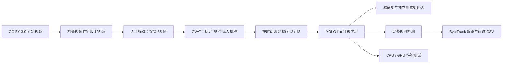

# 无人机检测与跟踪 Demo

[English README](README.md) | [GitHub 发布指南](GITHUB_PUBLISHING.md)

这是一个小型但完整的计算机视觉项目：从公开视频开始，经过抽帧、人工筛选、
CVAT 标注、按时间切分数据集、YOLO11n 迁移学习、验证与独立测试，再到完整视频
检测、ByteTrack 跟踪、轨迹导出以及 CPU/GPU 性能测试。

它的重点不是宣称“模型已经可以实际部署”，而是完整、可解释地展示一个目标检测
项目如何建立、如何验证，以及如何诚实分析失败案例。视频后半段的无人机很小，
模型确实会漏检；这个现象被保留并量化，而不是通过随机切分相邻帧来掩盖。


## 项目结果概览

| 项目 | 结果 |
| --- | --- |
| 原始视频 | 1920 x 1080、25 FPS、64.88 秒 |
| 候选帧 | 以约 3 FPS 抽取 195 张 |
| 人工筛选 | 保留 85 张，淘汰 110 张 |
| 标注 | 85 个 YOLO 框，类别只有 `drone` |
| 数据切分 | 59 张训练 / 13 张验证 / 13 张测试，严格按时间顺序 |
| 模型 | 使用预训练 YOLO11n，`imgsz=960`，微调 50 个 epoch |
| 最佳模型 | 第 33 个 epoch，验证集 mAP@0.5:0.95 为 0.6602 |
| 测试集 | Precision 0.9838，Recall 0.3077，mAP@0.5:0.95 为 0.1525 |
| 完整视频检测 | 1,619 帧中有 707 帧输出检测，端到端约 45.2 FPS |
| 跟踪 | 679 帧有有效轨迹；一个真实无人机被切成 21 个跟踪片段 |
| 性能测试 | CPU 27.73 FPS；RTX 4060 为 123.58 FPS |

## 完整流程



## 视频来源与基本信息

本项目使用 Wikimedia Commons 上的
[“Quadcopter (drone)”](https://commons.wikimedia.org/wiki/File%3AQuadcopter_%28drone%29.webm)。
视频录制于 2018 年 5 月 29 日，以 CC BY 3.0 发布。原文件保存在：

```text
video/Quadcopter_(drone).webm
```

| 属性 | 数值 |
| --- | ---: |
| 分辨率 | 1920 x 1080 |
| 帧率 | 25 FPS |
| 容器记录帧数 | 1,622 |
| OpenCV 实际成功解码 | 1,619 帧 |
| 容器时长 | 64.88 秒 |
| 最后解码时间 | 64.72 秒 |
| 编码 | VP9 (`VP90`) |
| SHA-1 | `AB8E308532ED3483AB8D120AE23282EE5715E9EC` |

WebM 索引比 OpenCV 实际能解码的数量多 3 帧。本项目同时记录两个数值，没有把
这个差异隐藏掉。下载与校验方法见 [video/README.md](video/README.md)。

## 数据是怎样制作的

### 1. 抽帧与筛选

以大约 3 FPS 从完整视频中抽取 195 个候选帧，覆盖 0.00-64.68 秒。随后进行人工
筛选：保留无人机清晰可定位、且对训练有价值的图像；删除空帧、无法可靠判断的帧
以及过度重复的相邻帧。最终保留 85 张，淘汰 110 张。

### 2. CVAT 人工标注

85 张保留图像均在 CVAT 中手动画矩形框，只有一个类别：

```text
0 = drone
```

YOLO 标签格式为：

```text
class_id x_center y_center width height
0 0.521 0.423 0.062 0.037
```

后四个值都按图像宽高归一化到 `[0, 1]`。验证脚本检查了图片和标签是否一一对应、
类别是否正确、数值是否合法、框是否越界，以及每张图是否恰好有一个框。85 组标签
全部通过检查。

### 3. 训练、验证、测试分别到多少秒

数据不是随机打散，而是按原视频时间排序后切成连续区间：

| 数据集 | 数量 | 原视频时间 | 原图中框的中位尺寸 | 框尺寸范围 |
| --- | ---: | ---: | ---: | ---: |
| 训练集 | 59 | 0.68-39.36 秒 | 222 x 85 px | 宽 115.1-1,262.7；高 45.7-298.8 px |
| 验证集 | 13 | 39.68-44.36 秒 | 328 x 124.3 px | 宽 111.5-813.2；高 55.7-335.3 px |
| 测试集 | 13 | 44.68-54.68 秒 | 28 x 13.9 px | 宽 19.4-91.4；高 9.5-43.0 px |

因此可以简要表述为：**训练数据大约到视频第 40 秒，验证数据到 44 秒左右，测试
数据到 55 秒左右。** 这里的时间范围指入选的标注帧，并不是区间内的每一帧都参加
训练。54.68 秒之后到视频结束只用于完整视频推理和肉眼检查，没有进入这次有标签的
测试集。

采用时间切分，是因为相邻视频帧非常相似。如果随机打散，很可能把几乎相同的画面
同时放进训练集和测试集，得到虚高的结果。时间切分更难，但更接近“模型能否处理
后续画面”的真实问题。

## 模型是怎样训练的

项目从官方预训练 `yolo11n.pt` 开始迁移学习，而不是从随机权重训练。预训练模型
已经学到边缘、纹理、形状等通用视觉特征；这里只需要用少量 UAV 图像做针对性微调。

| 参数 | 设置 |
| --- | --- |
| 模型 | 预训练 YOLO11n 检测模型 |
| Epoch | 50 |
| 输入尺寸 | 960 |
| Batch size | 8 |
| GPU | NVIDIA GeForce RTX 4060 8 GB |
| Worker | 4 |
| Early-stopping patience | 20 |
| 随机种子 | 42 |
| Cache | 开启 |
| 混合精度 | 开启 |

训练命令：

```powershell
.venv\Scripts\python.exe src\train_yolo.py `
  --model yolo11n.pt `
  --epochs 50 `
  --imgsz 960 `
  --batch 8 `
  --device 0 `
  --workers 4 `
  --patience 20 `
  --seed 42 `
  --cache
```

验证集在训练过程中用于观察泛化能力并选择最佳 checkpoint。最佳模型出现在第 33 个
epoch。测试集不参与模型选择，训练完成后才单独评估。

```text
outputs/models/uav_detector_best.pt   最佳验证模型
outputs/models/uav_detector_last.pt   第 50 个 epoch 的模型
```

## 验证和测试结果怎样理解

| 数据集 | 图片 | Precision | Recall | F1 | mAP@0.5 | mAP@0.5:0.95 |
| --- | ---: | ---: | ---: | ---: | ---: | ---: |
| 验证集 | 13 | 0.9869 | 1.0000 | 0.9934 | 0.9950 | 0.6602 |
| 测试集 | 13 | 0.9838 | 0.3077 | 0.4688 | 0.3050 | 0.1525 |

- **Precision（精确率）**：模型报出的框中，有多少是正确的。测试集精确率高，说明
  模型只要报框，通常没有报错。
- **Recall（召回率）**：所有真实无人机中，有多少被找到了。测试集 0.3077 大约相当
  于 13 个标注实例只找到了 4 个。
- **F1**：Precision 和 Recall 的调和平均值，其中一个低，F1 就会明显下降。
- **mAP@0.5**：预测框和真实框的 IoU 至少达到 0.5 时，综合不同置信度阈值计算的
  平均精度。
- **mAP@0.5:0.95**：从 IoU 0.50 到 0.95 采用多组更严格阈值，因此也更强调定位
  是否准确。
- **IoU**：预测框与真实框的交并比。它不是视频框旁边显示的 `0.9...`。

验证集很好、测试集明显下降并不矛盾。测试集位于更靠后的视频区间，目标尺寸发生了
明显变化，真正暴露了模型没有覆盖的小目标情况。

## 为什么后面无人机特别小时检测不到

最主要原因是训练样本没有覆盖这种目标尺度：

1. 训练集目标框的中位尺寸约为 `222 x 85 px`，最小也约为 `115 x 46 px`。
2. 测试集目标框中位尺寸只有 `28 x 14 px`，高度最小约 `9.5 px`。
3. `imgsz=960` 推理时，1920 像素宽的画面大约缩小一半；中位测试目标只剩约
   `14 x 7` 个输入像素。
4. 检测网络还会继续下采样生成特征图。一个只有几像素高的目标，经过缩放和下采样
   后几乎没有稳定的形状与纹理；视频压缩、运动模糊、镜头移动和背景相似都会进一步
   增加难度。
5. UAV 微调训练集中没有相同大小的无人机样本，模型没有学到这个尺度上的可靠特征。
6. 置信度低于阈值后不会输出框；ByteTrack 长时间收不到检测框，也就无法继续维持
   原来的轨迹 ID。

因此测试集会表现为“Precision 很高、Recall 很低”：模型比较保守，报出的少量框
通常是对的，但多数极小目标被漏掉。优先解决方法是增加不同场景中的小型、远距离
无人机样本，并加入空帧、鸟类和飞机等 hard negatives。仅仅多训练几个 epoch，通常
无法弥补数据尺度缺失。

后续还可以尝试更高输入分辨率、切片/分块推理、专门的小目标增强或更大的模型，
但应先补数据，再比较模型结构。

## 检测视频中的数字代表什么

检测视频可以这样生成：

```powershell
.venv\Scripts\python.exe src\detect_video.py --device 0
```

框旁边例如 `drone 0.94`：

- `drone` 是预测类别；
- `0.94` 是当前模型对这个候选框属于 `drone` 的**置信度分数**；
- 数值越高，模型当前证据越强。

但 `0.94` 不是严格校准后的“现实世界正确概率 94%”，也不是 IoU，更不是跟踪 ID。
本次检测视频阈值是 0.30，低于 0.30 的框不显示。跟踪阶段为了给 ByteTrack 更多弱
检测用于关联，阈值降为 0.10。继续降低阈值可能找回一部分小目标，同时也会带来更多
误检。

检测 CSV 各列含义：

```text
frame_number       原视频帧号
timestamp_seconds  时间戳（秒）
class_id/name      类别编号和名称
confidence         检测置信度
x1,y1,x2,y2        框的左上角和右下角像素坐标
center_x/center_y  框中心像素坐标
```

707 个“有检测的帧”只是完整视频的推理记录，不是准确率。因为完整视频的每一帧没有
全部人工标注，无法据此判断每次检测是 TP、FP 还是漏检。

## 跟踪视频中的信息代表什么

```powershell
.venv\Scripts\python.exe src\track_video.py --device 0
```

- `Drone #ID`：ByteTrack 临时轨迹编号，不是无人机总数；
- 框旁小数：当前检测置信度；
- 彩色轨迹线：最近 30 个框中心的位置；
- 方向与 `px/s`：图像平面中的移动方向和像素速度；
- `Active tracks`：当前帧还有效的轨迹数量；
- `IDs seen`：到当前帧为止出现过多少个轨迹编号。

视频中只有一台真实无人机，却产生了 21 个 ID。这表示检测中断后，ByteTrack 多次
重新建立轨迹，形成了 21 个轨迹片段，并不表示看到了 21 台无人机。

图像坐标中 x 向右增大，y 向下增大。`px/s` 不是无人机真实的 m/s，它同时包含镜头
移动、透视变化、检测框抖动等影响。要换算真实速度，需要相机标定、距离或场景尺度。

## 如何查看结果

在 Windows PowerShell 中：

```powershell
Start-Process "outputs\detections\Quadcopter_detection.mp4"
Start-Process "outputs\tracking\Quadcopter_tracking.mp4"
Start-Process "outputs\plots\training\results.png"
Start-Process "outputs\plots\evaluation_test\val_batch0_pred.jpg"
```

查看 CSV：

```powershell
Import-Csv "outputs\detections\detections.csv" | Out-GridView
Import-Csv "outputs\tracking\trajectory.csv" | Out-GridView
Import-Csv "outputs\metrics\evaluation_metrics.csv" | Format-Table
Import-Csv "outputs\metrics\benchmark.csv" | Format-Table
```

| 文件 | 内容 |
| --- | --- |
| `outputs/models/uav_detector_best.pt` | 按验证集选出的最佳模型 |
| `outputs/plots/training/results.png` | 训练损失和指标曲线 |
| `outputs/plots/evaluation_test/` | 测试集预测图、PR/F1 曲线和混淆矩阵 |
| `outputs/detections/Quadcopter_detection.mp4` | 完整视频检测结果 |
| `outputs/detections/detections.csv` | 每个检测框的坐标和置信度 |
| `outputs/tracking/Quadcopter_tracking.mp4` | ID、轨迹、方向和像素速度 |
| `outputs/tracking/trajectory.csv` | 逐帧轨迹与运动信息 |
| `outputs/metrics/benchmark.csv` | CPU/GPU 性能汇总 |

OpenCV 输出的 MP4 只包含视频画面，不复制原视频音轨。

## CPU/GPU 性能结果

性能脚本在完整视频上均匀选 24 帧，每个设备预热 5 次，再重复 3 轮，共计每个设备
72 次 batch=1 测量。GPU 每次测量前后都显式同步 CUDA。

| 设备 | 平均延迟 | 中位延迟 | P95 | 吞吐量 |
| --- | ---: | ---: | ---: | ---: |
| Intel Core i7-14700K，PyTorch 8 线程 | 36.06 ms | 35.63 ms | 40.18 ms | 27.73 FPS |
| NVIDIA GeForce RTX 4060 | 8.09 ms | 7.23 ms | 11.50 ms | 123.58 FPS |

计时包含预处理、CPU/GPU 数据传输、模型推理、NMS 和把最终框取回 CPU；不包含视频
解码、画框、编码、模型加载和预热。RTX 4060 的平均延迟约快 4.46 倍。这个结果只
代表本机和当前配置，不是所有硬件上的通用性能。

## 安装和运行

建议使用 Python 3.12：

```powershell
python -m venv .venv
.venv\Scripts\python.exe -m pip install --upgrade pip
.venv\Scripts\python.exe -m pip install torch torchvision --index-url https://download.pytorch.org/whl/cu128
.venv\Scripts\python.exe -m pip install -r requirements.txt
```

不同显卡和驱动应按 PyTorch 官方安装器选择合适版本。只使用 CPU 时不需要 CUDA 包。

完整复现实验的顺序：

```powershell
.venv\Scripts\python.exe src\inspect_video.py --preview-count 8
.venv\Scripts\python.exe src\extract_frames.py --target-fps 3
# 人工完成 selected/rejected 筛选
.venv\Scripts\python.exe src\reconcile_screening.py --require-complete
# 在 CVAT 标注并把 YOLO txt 导出到 data/labels
.venv\Scripts\python.exe src\validate_labels.py --preview-count 12 --seed 42
.venv\Scripts\python.exe src\prepare_dataset.py --train-ratio 0.70 --val-ratio 0.15
.venv\Scripts\python.exe src\train_yolo.py --model yolo11n.pt --epochs 50 --imgsz 960 --batch 8 --device auto --workers 4 --patience 20 --seed 42 --cache
.venv\Scripts\python.exe src\evaluate_model.py --split both --imgsz 960 --batch 8 --device auto --workers 4
.venv\Scripts\python.exe src\detect_video.py --device auto
.venv\Scripts\python.exe src\track_video.py --device auto
.venv\Scripts\python.exe src\benchmark.py --devices both
```

公开仓库默认不提交原视频、抽出的训练图片、模型权重和生成视频。推理时需要把源视频
和最佳模型分别放到：

```text
video/Quadcopter_(drone).webm
outputs/models/uav_detector_best.pt
```

这些较大的文件建议作为 GitHub Release assets 发布，具体步骤见
[GITHUB_PUBLISHING.md](GITHUB_PUBLISHING.md)。

## 局限和下一步

- 数据只有一个视频、一个场景、一个摄像机和一台真实无人机；
- 训练集只有 59 张图，验证集和测试集各 13 张；
- 有标签的数据全都包含无人机，没有系统评估纯背景误检；
- 训练集中没有与视频后段同尺度的极小无人机；
- `max_det=1`，不支持多无人机或蜂群场景；
- 漏检会导致 ByteTrack ID 碎片化；
- 轨迹速度只是图像像素速度，不是实际物理速度。

下一版最重要的工作是增加不同天气、背景、相机和机型的数据，特别是远距离小目标，
并加入空帧、鸟类和飞机等难负样本，再使用完全独立的视频测试。

## Copyright 与许可证

原始视频不属于本项目。应保留以下署名：

> “Quadcopter (drone)” by Sounds of Changes / Työväenmuseo Werstas；录音、
> 录像及摄影：Mikael Maffei；录制于 2018 年 5 月 29 日；通过 Wikimedia Commons
> 发布，许可证为 Creative Commons Attribution 3.0 Unported。

- [原视频页面](https://commons.wikimedia.org/wiki/File%3AQuadcopter_%28drone%29.webm)
- [CC BY 3.0 许可证](https://creativecommons.org/licenses/by/3.0/)
- 本项目所作修改：抽取部分帧、缩放模型输入、添加检测框、置信度、跟踪 ID、轨迹和
  HUD，并把处理结果编码为不含原音频的 MP4。

CC BY 3.0 允许分享和修改，但需要给出适当署名、许可证链接并说明做过的修改，也不能
暗示原作者为本项目背书。发布处理后的视频或标注图像时，应同时保留这段说明。

Ultralytics 的开源框架和模型采用 AGPL-3.0，同时提供 Enterprise 商业许可。正式上传
前，应在仓库根目录加入与实际使用方式一致的 `LICENSE`。对于公开作品集 Demo，
AGPL-3.0 是与当前 Ultralytics 开源使用方式一致的直接选择；闭源或商业用途需要重新
审查许可证。

视频的 CC BY 3.0、项目代码许可证和第三方软件许可证彼此独立，不能互相替代。
